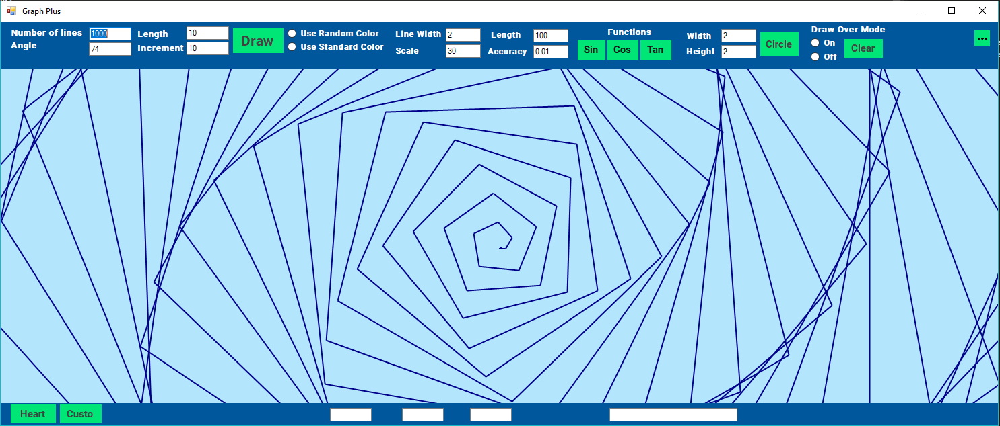
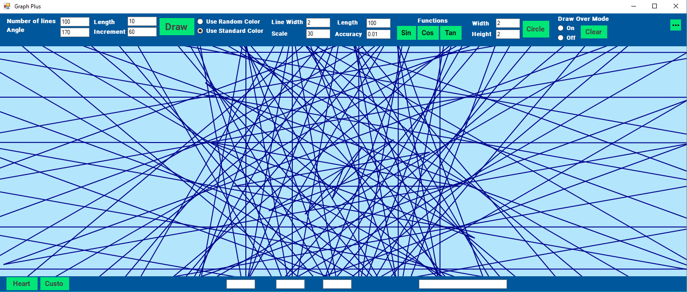
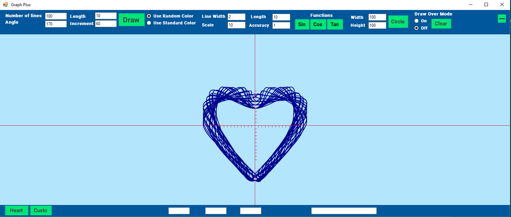
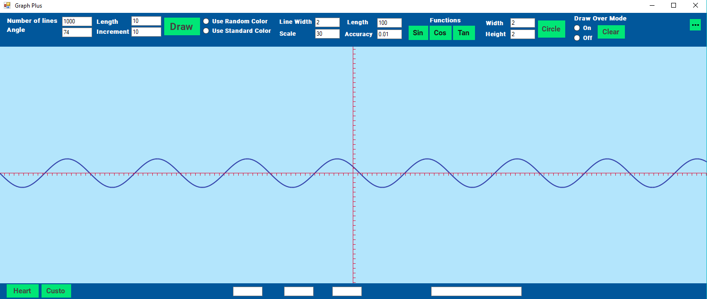
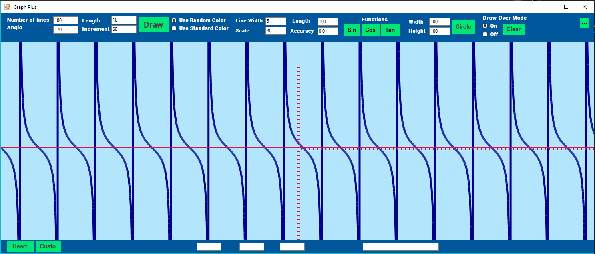

#A win forms app that draws things
==NOTE== This is a project I created while I was just starting out and there are bugs! 

Due to the odd nature of this project I was not able to think of a suitable name for it.
This is one of the first C# applications I created. I made it because I was interested in drawing a sin graph in C# but it grew into something more interesting. There is no real practical use for the project, it was only to expand my C# skills.

Original Creation Date: 20th Nov 2017

